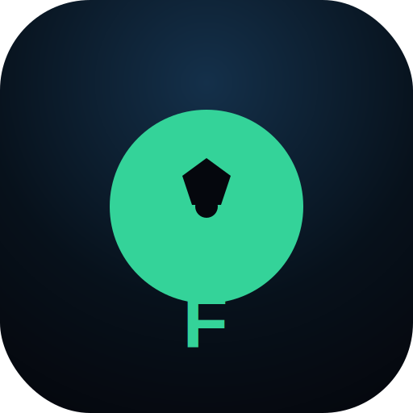

<div align="center">



# ⚽ Dictator Mbappé

### Draft an all-time World Cup XI from the legends of 1982–2022, then rule the tournament.

Pick a formation, draft your dream squad one legend at a time, manage a star-points budget,
set your tactics — then watch your team battle through a 48-team World Cup, penalties and all.
**One shot. No mercy.**


</div>

---

## ✨ Features

- **Two draft modes**
  - **Position Draft** — each draw offers a player for every open slot; pick one, place him, repeat.
  - **By Nation** — each draw shows a full national squad from a random World Cup; take one player, then a new nation appears.
- **Real squad data** — every men's World Cup squad **1982–2022**, with **data-driven ratings** computed from each player's actual goals, starts/appearances, how far their team advanced, and individual awards (Golden Ball, Golden Glove…).
- **Star-points budget** — every legend has a cost; you can't field eleven 99s.
- **Chemistry** — players from the same nation or era link up and boost your side.
- **Captain & tactics** — name a captain (extra strength + scoring), and slide between defensive and attacking football.
- **Deep 48-team simulation** — seeded group draw with pots → R32 → Final, with **fatigue & injuries that carry across rounds**, **red cards**, **extra time**, **rival manager personalities**, **momentum**, an **MVP of the tournament**, and per-match goalscorers.
- **Interactive penalty shootouts** — take them yourself (tap to shoot/dive) or simulate.
- **Daily Challenge** — a seeded draw that's identical for everyone, with a reproducible result.
- **Hall of Fame** — your best finish, titles, and champion XI persist locally.
- **Shareable result card** — export your XI + result as an image and share it.
- **Built to feel good** — Motion animations, confetti for champions, sound effects, and an installable **PWA** with offline support.

## 🛠 Tech stack

| | |
|---|---|
| Framework | [Next.js 16](https://nextjs.org) (App Router) + React |
| Language | TypeScript (strict) |
| Styling | Tailwind CSS v4 |
| Animation | [Motion](https://motion.dev) (`motion/react`) |
| Icons | lucide-react |
| Extras | html-to-image (share card), canvas-confetti, Web Audio (sound) |
| Data | [Fjelstul World Cup Database](https://github.com/jfjelstul/worldcup) (CC-BY-SA 4.0) |

## 🚀 Getting started

```bash
git clone https://github.com/bajshorya/dictator_mbappe.git
cd dictator_mbappe
npm install
npm run dev
```

Open [http://localhost:3000](http://localhost:3000).

```bash
npm run build   # production build
npm start       # serve the production build
npm run lint    # lint
```

> Requires **Node 18+** (developed on Node 24).

## 🎮 How to play

1. **Choose a mode & difficulty** (and optionally the Daily Challenge).
2. **Pick a formation** — it sets the slots you'll draft into.
3. **Draft your XI** — tap a drawn player, then tap a matching slot. Placing one auto-draws the next set (manual rerolls are limited). Mind your **star budget** and build **chemistry**.
4. **Set a captain** (tap the crown) and your **tactics**.
5. Once your XI is complete, hit **Rule the World Cup** — optionally add up to 7 substitutes first.
6. Watch the tournament play out, take your penalties, and chase the trophy. **It's one shot** — to change your squad, play again.

## 🧠 The data

There's no public API that exposes *knockout-stage players with a performance rating tied to one specific tournament* — those ratings are inherently editorial. So the dataset is generated from the **Fjelstul World Cup Database** and rated heuristically:

```bash
node scripts/build-wc-squads.mjs   # → src/data/wc-squads.json
```

The script downloads the source CSVs, filters to **men's World Cups 1982–2022** and a curated set of recognisable nations, and computes each player's rating by **blending their performance in that tournament with their career-peak World Cup rating** (so a legend who had one bad tournament still rates like a legend).

## 📁 Project structure

```
src/
  app/            # Next.js routes, layout, manifest, OG image, global styles
  components/     # PitchView, PlayerCard, SimulationView, Shootout, ShareCard, …
  data/           # generated wc-squads.json, formations, national teams
  lib/            # simulate, generate, chemistry, cost, storage, rng, sound, flags
scripts/
  build-wc-squads.mjs   # regenerates the squad dataset
public/           # icon, service worker
```

## 📜 License & attribution

- **Code** is licensed under the **[MIT License](LICENSE)**.
- **Squad data** is derived from the [Fjelstul World Cup Database](https://github.com/jfjelstul/worldcup), licensed **CC-BY-SA 4.0** — any redistribution of the data must keep that license and attribution.
- Player flags are emoji; nations and ratings are for a game, not an official record.

## 🙌 Credits

Built by **[Shorya Baj](https://github.com/bajshorya)**.
Data: the **Fjelstul World Cup Database**.

---

<div align="center">
Made with ⚽ and far too many penalty shootouts.
</div>
